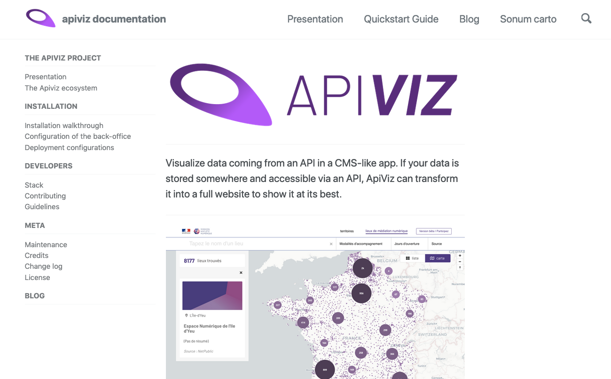
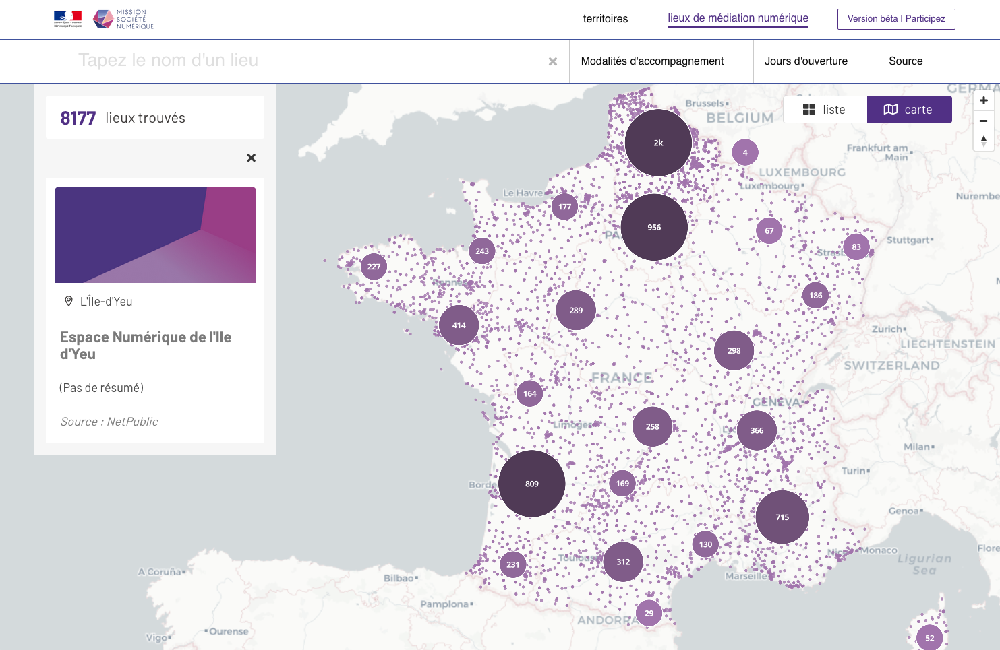

## FRONTEND


-------
## PRESENTATION

Visualize data coming from an API in a CMS-like app. 
If your data is stored somewhere and accessible via an API, ApiViz can transform it into a full website to show it at its best. 

ApiViz includes "out-the-box" a back-office to fully configure an original datavisualisation website 

--------

#### WARNING : 

**apiviz-frontend** is only the frontend of the APIVIZ application, it only works if and only if the **[apiviz-backend](https://github.com/co-demos/apiviz-backend)** is correctly installed first.


--------

## DOCUMENTATION 

Check out our brand new documentation website on Github pages : https://co-demos.github.io/apiviz-frontend/

[](https://co-demos.github.io/apiviz-frontend/)
<!-- -------- -->

<!--  -->

--------

## THE APIVIZ ECOSYSTEM

ApiViz is designed to **agnosticaly display data** and provide an engine to deploy a **datavisualisation website** without (too much) pain, not regarding to the service(s) serving and storing the data. 

Nevertheless to do so an instance of ApiViz must be connected to several external services : one for authentication, one for serving the data, one for storing the static contents (html pages, images...).

The goal of ApiViz is to **work with any external service** fulfilling those roles, but we developed an **eco-system of open source applications** allowing a complete and free way to deploy such a datavisualisation service. 

<br>

| logo | the open source eco-system ( aka TADATA! ) |
|    :----:   |          :--- |
|  | **[Apiviz](https://github.com/co-demos/ApiViz)** as the high-level app for visualisation, a sort of open source CMS for data-visualisation ;   |
|  | **[Solidata](https://github.com/entrepreneur-interet-general/solidata_frontend)** to "API-fy" your data and manage open data projects ; |
|  | **[TokTok](https://github.com/co-demos/toktok)** for a dedicated authentication service to manage users, JWT, and roles.  |
|  | **[OpenScraper](https://github.com/entrepreneur-interet-general/OpenScraper)** is a generic web scraper serving the results of the scraping via its API  |


--------

## DEVELOPERS

Please check out our *[guidelines](./GUIDELINES_DEV.md)*

You can also check the *[development roadmap for future features](https://github.com/co-demos/apiviz-frontend/projects/1)*

--------

## INSTALLATION WALKTHROUGH 

--------

Before anything you need to install **[Apiviz-backend](https://github.com/co-demos/apiviz-backend)** to serve your configuration to the frontend.

## Build setup (with Nuxt)

``` bash
# install dependencies
$ npm install

# serve with hot reload at localhost:3000
# get env vars from .env file
$ npm run dev

# overwrites .env file with env vars from script in package.json
$ npm run dev-test

# get env vars from .env file but overwrites NUXT_BACKEND_MODE as local backend served with Docker
$ npm run dev-docker

# build for production and launch server
$ npm run build
$ npm start

# generate static project
$ npm run generate
```

... then check in your browser : [`localhost:3000`](localhost:3000)

## Build setup (with Docker)

``` bash
# install / stop / restart

$ make up # run app with Docker
$ make restart # restart app with Docker
$ make down # stop app with Docker
```

... then check in your browser : [`localhost:3333`](localhost:3333)
